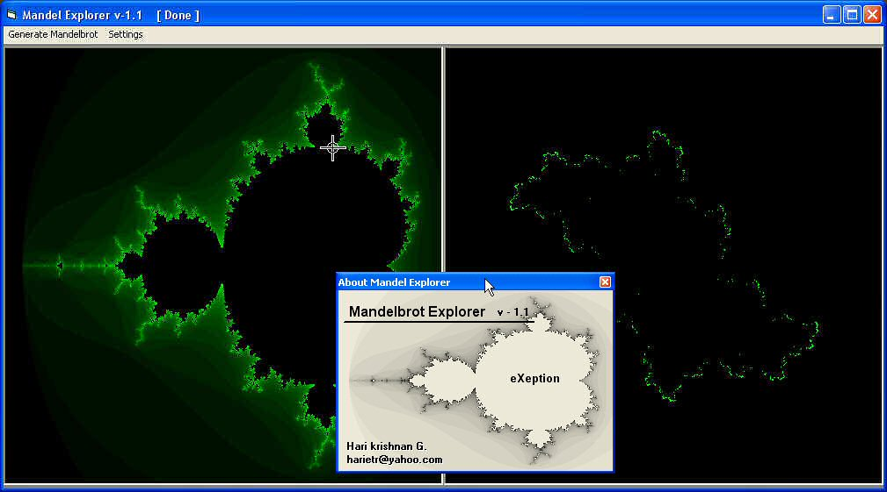



## Mandelbrot \- Julia Set RealTime Explorer\.  \(\*\*\*See ScreenShot\*\*\*\*\)

### Description

This is a demo of the Mandelbrot and Juli sets.

The Mandel Brot set is the superset of the julia sets, and this demo you can move cursor at various points and the corresponding Julia set is generated realtime!!!

All the Parameters and colors are customizable.

Mandelbrot and Julia sets can be generated within Square or rectangular canvases (Settings menu).

This is a COOL CODE and is REALLY FAST!!!

So please rate me if you like this!
 
### More Info
 

             |
---                |---
**Submitted On**   |2004-01-09 22:19:30
**By**             |[Hari Krishnan](https://github.com/Planet-Source-Code/PSCIndex/blob/master/ByAuthor/hari-krishnan.md)
**Level**          |Intermediate
**User Rating**    |5.0 (15 globes from 3 users)
**Compatibility**  |VB 6\.0
**Category**       |[Graphics](https://github.com/Planet-Source-Code/PSCIndex/blob/master/ByCategory/graphics__1-46.md)
**World**          |[Visual Basic](https://github.com/Planet-Source-Code/PSCIndex/blob/master/ByWorld/visual-basic.md)
**Archive File**   |[Mandelbrot1796219212004\.zip](https://github.com/Planet-Source-Code/hari-krishnan-mandelbrot-julia-set-realtime-explorer-see-screenshot__1-56290/archive/master.zip)

